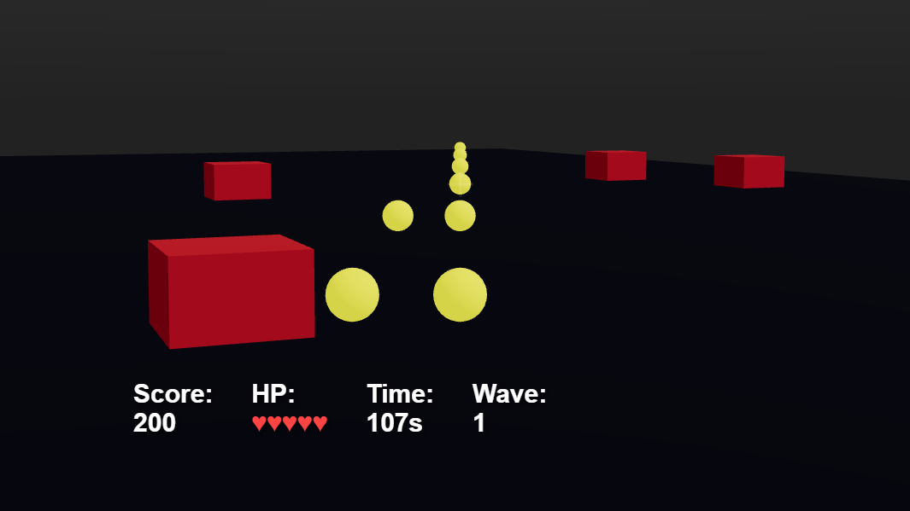

# XRift World - 2Dシューティング




## 概要

XRiftプラットフォーム向けの2Dシューティングゲーム。React Three FiberとRapier物理エンジンを用い、シューティングゲームメカニクスを実装しています。

## 特徴

- 🎮 2Dシューティングゲームプレイ機構（GameManagerで管理）
- 🎵 BGMと効果音（Shoot, Damage, PowerUp）
- 🎯 敵キャラクター（Duck）の動的生成
- 💥 弾幕パターンシステム（bulletPattern.ts）
- 🎨 ダイナミックなUIシステム（GameUI.tsx）
- 📊 スコア・ゲージ管理システム

## 技術スタック

- React 19 / TypeScript 5 / Vite 7
- @react-three/fiber 9.5 / @react-three/drei 10.7
- @react-three/rapier 2.2（物理演算）
- @xrift/world-components 0.15
- Three.js 0.182

## セットアップ

```bash
npm install
npm run dev
```

- 開発サーバー: http://localhost:5173
- 本番ビルド: `npm run build`
- 型チェック: `npm run typecheck`
- プレビュー: `npm run preview`

XRiftへのアップロード: `xrift upload world`

## ワールド構成

- メインシーン: [src/World.tsx](src/World.tsx)
- コンポーネント
  - ゲームマネージャー: [src/components/Game/index.tsx](src/components/Game/index.tsx)
  - ゲームUI: [src/components/Game/GameUI.tsx](src/components/Game/GameUI.tsx)
  - 弾幕パターン: [src/components/Game/bulletPattern.ts](src/components/Game/bulletPattern.ts)
  - ダック（敵）: [src/components/Duck/index.tsx](src/components/Duck/index.tsx)
  - インタラクティブボタン: [src/components/InteractableButton/index.tsx](src/components/InteractableButton/index.tsx)
  - 回転オブジェクト: [src/components/RotatingObject/index.tsx](src/components/RotatingObject/index.tsx)
  - リモートユーザーHUD: [src/components/RemoteUserHUDs/index.tsx](src/components/RemoteUserHUDs/index.tsx)
  - スカイボックス: [src/components/Skybox/index.tsx](src/components/Skybox/index.tsx)

## アセット

- 背景・テクスチャ: `public/tokyo-station.jpg`
- 3Dモデル: `public/duck.glb`（敵キャラクター）
- BGM: `public/BGM.mp3`
- 効果音:
  - `public/Shoot.mp3`（射撃音）
  - `public/Damage00.mp3`, `public/Damage10.mp3`（ダメージ音）
  - `public/PowerUp.mp3`（パワーアップ音）
- サムネイル: `public/thumbnail.png`

## ディレクトリ構成

```
game3/
├── public/
│   ├── BGM.mp3
│   ├── Damage00.mp3
│   ├── Damage10.mp3
│   ├── PowerUp.mp3
│   ├── Shoot.mp3
│   ├── duck.glb
│   ├── tokyo-station.jpg
│   └── thumbnail.png
├── src/
│   ├── components/
│   │   ├── Game/
│   │   │   ├── index.tsx
│   │   │   ├── GameManager.tsx
│   │   │   ├── GameUI.tsx
│   │   │   └── bulletPattern.ts
│   │   ├── Duck/
│   │   ├── InteractableButton/
│   │   ├── MemberBoard/
│   │   ├── RemoteUserHUDs/
│   │   ├── RotatingObject/
│   │   └── Skybox/
│   ├── constants.ts
│   ├── dev.tsx
│   ├── index.tsx
│   └── World.tsx
├── package.json
├── tsconfig.json
├── vite.config.ts
└── xrift.json
```

## ワールド設定

### 物理パラメータ（xrift.json）

```json
{
  "physics": {
    "gravity": 9.81,
    "allowInfiniteJump": true
  }
}
```

### ワールドサイズ

| パラメータ | 値 | 用途 |
|-----------|-----|------|
| `size` | 20 | ワールドのベースサイズ |
| `wallHeight` | 5 | 壁の高さ |
| `wallThickness` | 0.5 | 壁の厚さ |

## 開発メモ

- ローカル開発では `dev.tsx` で `XRiftProvider` を baseUrl `/` でラップしています。
- アセット読み込みは常に `useXRift()` から得る `baseUrl` を接頭辞として使用してください。
- ゲーム機構の中核は `GameManager` コンポーネントで、`useFrame`フックを用いてフレームごとの更新ロジックを実装しています。
- 弾幕パターンは `bulletPattern.ts` で定義されており、複数のパターンを組み合わせることで難易度調整が可能です。

## ライセンス

MIT
